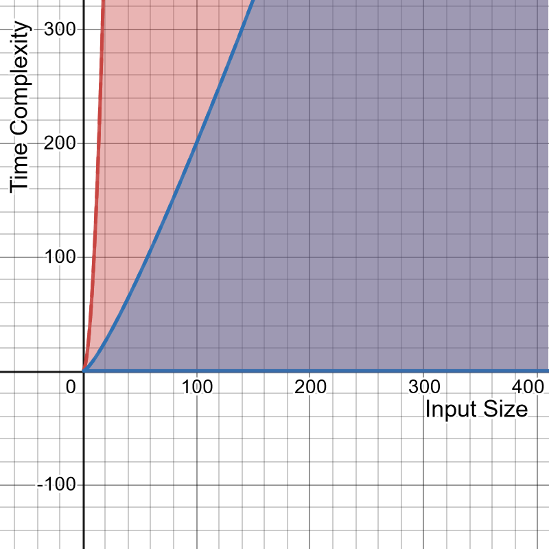

# Study Case

Heri adalah guru matematika SMA. Heri ingin mengurutkan data nilai UAS Matematika siswa dari terendah ke tertinggi.

# Solution

## First Approach - Bubble Sort
Sorting dengan mengiterasi daftar nilai siswa secara berulang-ulang dan membandingi nilai siswa pertama dengan nilai siswa berikutnya

**Pseudocode:**

```javascript
for Row in array of Siswa : // O(n)
    for Siswa in Row :    // O(n)
        if Nilai Siswa pertama > Nilai Siswa berikutnya :
            swap(Siswa pertama, Siswa berikutnya)

// O(n) * O(n) = O(n^2)
```

- Worst-case Scenario: ***`O(n^2)`***


## Second Approach - Merge Sort

Sorting dengan membagikan daftar nilai siswa menjadi dua bagian secara rekursif sampai tidak bisa dibagi lagi, lalu menggabungkan pecahan tersebut menjadi daftar nilai siswa yang sudah tersortir.

**Pseudocode:**

```javascript
function MergeSort(arrayOfStudents):
    if arrayOfStudents hanya memiliki 1 siswa :
        return arrayOfStudents

    // Belah array menjadi dua bagian

    // Ambil posisi tengah dalam array siswa
    middleIndex = ⌊i / 2⌋

    // Bagian kiri array
    leftPartition = arrayOfStudents[0] to arrayOfStudents[middleIndex]

    // Bagian kanan array
    rightPartition = arrayOfStudents[middleIndex + 1] to arrayOfStudents[i]

    // Sortir pecahan array bagian kiri secara rekursif (O(log n))
    leftPartition = MergeSort(leftPartition)

    // Sortir pecahan array bagian kanan secara rekursif (O(log n))
    rightPartition = MergeSort(rightPartition)

    // Gabungkan pecahan array tersebut (O(n))
    return Merge(leftPartition, rightPartition)

function Merge(leftPartition, rightPartition):
    // tempArray adalah array dari hasil gabungan array leftPartition dan array rightPartition
    var tempArray

    while leftPartition && rightPartition tidak kosong :
        if leftPartition[0] > rightPartition[0] :
            add item pertama dalam rightPartition ke tempArray
            delete item pertama dalam rightPartition
        else
            add item pertama dalam leftPartition ke tempArray
            delete item pertama dalam leftPartition

    while leftPartition tidak kosong :
        add item pertama dalam leftPartition ke tempArray
        delete item pertama dalam leftPartition

    while rightPartition tidak kosong :
        add item pertama dalam rightPartition ke tempArray
        delete item pertama dalam rightPartition

    return tempArray

/*
Visual Representation example
ms() = MergeSort(array)
Number of elements (n) = 6

                Time Complexity: O(n log n)
                        -> O(6 log 6)
                        -> O(6 * 3) = 3 level pembagian untuk 6 elemen
                   ms([1, 6, 3, 5, 4, 2])
                             ^
                           /   \
                          /     \
                         /       \
              O(n)      /         \    O(n)
          ms([1, 6, 3])           ms([5, 4, 2])   // Level 1
                 ^                        ^
                / \                      / \
               /   \                    /   \
              /     \                  /     \
             /       \                /       \
      O(n)  /         \  O(n)        / O(n)    \   O(n)
      ms([1])        ms([6, 3])   ms([5])     ms([4, 2])   // Level 2
          /      |      \          /       |     \
         /       |       \        /        |      \
        /        |        \      /         |       \
    ms([1])     ms([3]) ms([6]) ms([5])   ms([2])  ms([4]) // Level 3
                  \                        /
                   \                      /
                    \                    /
                     \                  /
                      \                /
                      [1, 2, 3, 4, 5, 6]
*/
```

- Worst-case & Best-case Scenario: ***`O(n log n)`***

# Time complexity

Approach 1 & Approach 2 Complexity Plot

**Red**: Approach 1 ***`O(n^2)`***

**Blue**: Approach 2 ***`O(n log n)`***


